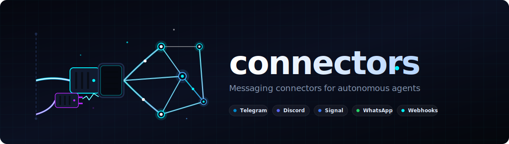

# connectors

**🇬🇧 English** | [🇩🇪 DE](README_de.md) | [🇪🇸 ES](README_es.md) | [🇯🇵 JA](README_ja.md) | [🇷🇺 RU](README_ru.md) | [🇨🇳 ZH](README_zh-Hans.md)

> Messaging connectors for autonomous agents — Telegram, Discord, Signal, WhatsApp, Home Assistant, and webhooks.

[](LICENSE)
[](CHANGELOG.md)

Extracted and decoupled from [BACH](https://github.com/ellmos-ai/bach). No framework required. Zero mandatory external dependencies (stdlib only).

**Quick links:** [Supported Connectors](#supported-connectors) · [Quick Start](#quick-start) · [Changelog](CHANGELOG.md)

## Supported Connectors

| Connector       | Protocol              | Source                     | Status  |
|-----------------|-----------------------|----------------------------|---------|
| `telegram`      | Telegram Bot API      | Ported from BACH           | Stable  |
| `discord`       | Discord Bot + Webhook | Ported from BACH           | Stable  |
| `signal`        | signal-cli            | Ported from BACH           | Stable  |
| `whatsapp`      | WhatsApp Business API | Ported from BACH           | Stable  |
| `homeassistant` | Home Assistant REST   | Ported from BACH           | Stable  |
| `webhook`       | Generic HTTP POST     | New (no BACH equivalent)   | Stub    |

The `webhook` connector is a **new addition** — it was mentioned in earlier
planning documents but did not exist in BACH. It is functional as a basic
outgoing-only HTTP POST connector and clearly marked as a stub/baseline.

## Quick Start

```python
import os
from connectors import create_connector, ConnectorConfig

# Telegram example
config = ConnectorConfig(
    name="my_bot",
    connector_type="telegram",
    auth_config={"bot_token": os.environ["TG_BOT_TOKEN"]},
    options={"owner_chat_id": ""},   # optional: only accept messages from this chat
)
conn = create_connector(config)
if conn.connect():
    conn.send_message("CHAT_ID", "Hello!")

# Receive messages (polling)
thread, stop = conn.poll_threaded(on_message=lambda m: print(m.content))
# ... later:
stop.set()
```

## Secrets

**Never hardcode tokens.** Recommended approaches:

```python
# 1. Environment variables (simplest)
auth_config={"bot_token": os.environ["TG_BOT_TOKEN"]}

# 2. python-dotenv
from dotenv import load_dotenv; load_dotenv()
auth_config={"bot_token": os.getenv("TG_BOT_TOKEN")}

# 3. SecretAdapter (framework integration, e.g. BACH)
from connectors.base import SecretAdapter

class MyAdapter(SecretAdapter):
    def get_secret(self, key: str) -> str:
        return my_vault.get(key, "")

conn = create_connector(config, secret_adapter=MyAdapter())
```

## Building a Custom Connector

Use the interactive wizard:

```bash
pip install pyyaml   # only needed for the wizard
python -m connectors.templates.setup_wizard
```

Or manually, using `templates/connector_template.py`:

1. Copy `connector_template.py` to `my_connector.py`
2. Replace all `{{PLACEHOLDER}}` markers
3. Implement `connect()`, `disconnect()`, `send_message()`, `get_messages()`
4. Register in `__init__.py` `_CONNECTOR_MAP`

## BACH Integration (optional)

To use this module within BACH, implement `SecretAdapter` pointing at
`hub.secrets_handler.SecretsHandler`:

```python
from connectors.base import SecretAdapter

class BachSecretAdapter(SecretAdapter):
    def get_secret(self, key: str) -> str:
        try:
            from hub.secrets_handler import SecretsHandler
            return SecretsHandler().get_secret(key) or ""
        except ImportError:
            return ""
```

BACH can then optionally switch its `connectors/` layer to this module.
See [BACH-REIMPORT-NOTE.md](BACH-REIMPORT-NOTE.md) for the relevant task note.

## Project Structure

```
connectors/
├── __init__.py                  # create_connector() factory
├── base.py                      # BaseConnector, Message, SecretAdapter
├── telegram_connector.py
├── discord_connector.py
├── signal_connector.py
├── whatsapp_connector.py
├── homeassistant_connector.py
├── webhook_connector.py         # Generic HTTP (stub/baseline)
├── templates/
│   ├── connector_template.py    # Template for new connectors
│   ├── setup_wizard.py          # Interactive CLI wizard
│   ├── telegram_template.yaml
│   ├── whatsapp_template.yaml
│   └── notification_template.yaml
├── LICENSE                      # MIT
├── requirements.txt             # pyyaml (wizard only), all else stdlib
├── CHANGELOG.md
├── TODO.md
└── llms.txt
```

## Dependencies

- **Core:** Python 3.8+, stdlib only (`urllib`, `json`, `threading`, `subprocess`)
- **Setup wizard:** `pyyaml` (`pip install pyyaml`)
- **signal_connector:** `signal-cli` binary — https://github.com/AsamK/signal-cli

## Development Smoke Tests

```bash
python -m pip install -e ".[wizard]"
python tests/test_imports.py
python -m compileall -q -x "templates[\\/]+connector_template\\.py" .
```

`templates/connector_template.py` intentionally contains placeholders and is
compiled only after the setup wizard renders a concrete connector module.

## Related Projects

- **lock-master** (https://github.com/dev-bricks/lock-master) — related multi-agent building block
- **ticket-master** (https://github.com/dev-bricks/ticket-master) — related multi-agent building block

## Related Modules

- **USMC** (`.MODULES/usmc`): Agent-to-agent shared memory
- **clutch** (`.MODULES/clutch`): Model routing (Agent-to-LLM)
- **connectors** (this module): Messaging (Agent-to-human)
