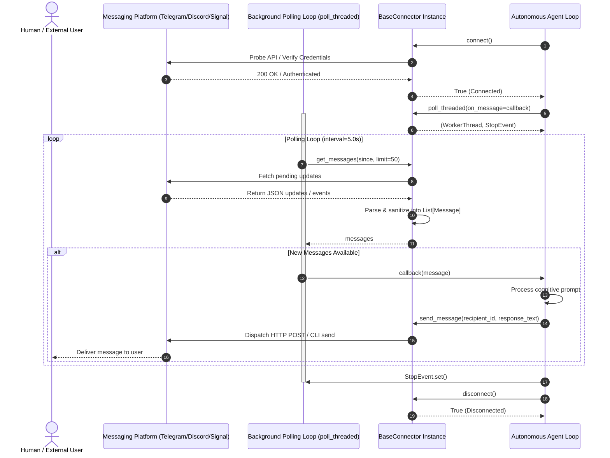

# connectors

**🇬🇧 English** | [🇩🇪 DE](README_de.md) | [🇪🇸 ES](README_es.md) | [🇯🇵 JA](README_ja.md) | [🇷🇺 RU](README_ru.md) | [🇨🇳 ZH](README_zh-Hans.md)

> Standalone, zero-dependency messaging connectors for autonomous AI agents — Telegram, Discord, Signal, WhatsApp, Home Assistant, and Webhooks.

[](LICENSE)
[](CHANGELOG.md)
[](pyproject.toml)
[](tests/)
[](.github/workflows/tests.yml)
[](pyproject.toml)
[](SECURITY.md)
[](https://github.com/ellmos-ai)
[](https://github.com/open-bricks)
[](llms.txt)

Extracted and decoupled from [BACH](https://github.com/ellmos-ai/bach). No external framework required. Zero mandatory runtime dependencies (100% Python standard library).

> [!NOTE]
> **LLM & Agent-Native Architecture**: `connectors` is engineered specifically for autonomous AI agents, multi-agent swarms, and cognitive runtime loops (such as [BACH](https://github.com/ellmos-ai/bach), [USMC](https://github.com/ellmos-ai/usmc), and [clutch](https://github.com/ellmos-ai/clutch)). It provides a zero-dependency, standardized messaging contract (`connect()`, `send_message()`, `poll_threaded()`) allowing AI agents to interact with human operators across multi-channel chat platforms without framework lock-in. Machine-readable context available at [llms.txt](llms.txt).

---

## Quick Navigation

- [Key Features](#key-features)
- [System Architecture](#system-architecture)
- [Interactive Messaging & Polling Lifecycle](#interactive-messaging--polling-lifecycle)
- [Supported Connectors & Status](#supported-connectors--status)
- [Governance & Safety Invariants](#governance--safety-invariants)
- [Quick Start](#quick-start)
- [Secret Management & Zero Leakage](#secret-management--zero-leakage)
- [Threaded Polling & Event Callbacks](#threaded-polling--event-callbacks)
- [Interactive Setup Wizard & Templates](#interactive-setup-wizard--templates)
- [BACH Framework Integration](#bach-framework-integration)
- [Sibling Ecosystem & Partner Repositories](#sibling-ecosystem--partner-repositories)
- [Smoke Testing & Verification](#smoke-testing--verification)
- [Security Policy & Vulnerability Reporting](#security-policy--vulnerability-reporting)

---

## Key Features

- **100% Python Standard Library Core**: Zero external runtime pip dependencies (`urllib`, `json`, `threading`, `subprocess`). No bloat, minimal attack surface.
- **Unified Abstract Connector Contract**: Standardized `BaseConnector` ABC with uniform signatures across Telegram, Discord, Signal, WhatsApp, Home Assistant, and Webhooks.
- **Zero Runtime Secret Leakage**: Credentials stored in `ConnectorConfig.auth_config` are hidden via `field(repr=False)`. All class `__repr__()` implementations mask secrets to prevent token exposure in logs.
- **Pluggable Credential Resolution**: Direct environment access (`os.environ`), `.env` support, or pluggable `SecretAdapter` for vault and framework integration.
- **Thread-Safe Decoupled Polling**: Built-in `poll_threaded()` background worker with `threading.Event` stop triggers and error isolation.
- **Multi-Platform Certified**: Verified and tested across Ubuntu Linux, Windows, and macOS via GitHub Actions.
- **Interactive Scaffolding CLI**: Standalone setup wizard (`python -m connectors.templates.setup_wizard`) with YAML templates for rapid connector authoring.

---

## System Architecture

```mermaid
flowchart TD
    subgraph AgentLayer ["Autonomous Agent / Client Layer"]
        A[Autonomous Agent / Multi-Agent Swarm]
        B[Cognitive Loop / Scheduler]
    end

    subgraph CoreFactory ["Core Factory & Configuration"]
        CF[create_connector Factory]
        CC[ConnectorConfig DataClass]
        SA[SecretAdapter Hook]
    end

    subgraph ConnectorsModule ["connectors Standalone Core (100% Stdlib)"]
        BC["BaseConnector (ABC)"]
        TC[TelegramConnector]
        DC[DiscordConnector]
        SC[SignalConnector]
        WC[WhatsAppConnector]
        HC[HomeAssistantConnector]
        WH[WebhookConnector]
    end

    subgraph ExternalPlatforms ["External Messaging Channels & Protocols"]
        EP_TG["Telegram Bot API (Long-Polling & Send)"]
        EP_DC["Discord Gateway / Webhook REST API"]
        EP_SG["signal-cli IPC / Subprocess Daemon"]
        EP_WA["WhatsApp Cloud / On-Premises Business API"]
        EP_HA["Home Assistant REST API / Notify"]
        EP_WH["Custom Webhook Endpoint (HTTP POST)"]
    end

    A -->|Instantiates Config| CC
    B -->|Secret Resolution| SA
    CC --> CF
    SA --> CF
    CF -->|Instantiates| BC

    BC --> TC
    BC --> DC
    BC --> SC
    BC --> WC
    BC --> HC
    BC --> WH

    TC -->|HTTPS POST / getUpdates| EP_TG
    DC -->|HTTPS POST / Execute Webhook| EP_DC
    SC -->|CLI Arguments (No Shell)| EP_SG
    WC -->|HTTPS POST / Graph API| EP_WA
    HC -->|HTTPS POST / Services| EP_HA
    WH -->|JSON Payload| EP_WH
```

---

## Interactive Messaging & Polling Lifecycle


```mermaid
sequenceDiagram
    autonumber
    actor Operator as Human / External User
    participant Platform as Messaging Platform (Telegram/Discord/Signal)
    participant Worker as Background Polling Loop (poll_threaded)
    participant Conn as BaseConnector Instance
    participant Agent as Autonomous Agent Loop

    Agent->>Conn: connect()
    Conn->>Platform: Probe API / Verify Credentials
    Platform-->>Conn: 200 OK / Authenticated
    Conn-->>Agent: True (Connected)

    Agent->>Conn: poll_threaded(on_message=callback)
    activate Worker
    Conn-->>Agent: (WorkerThread, StopEvent)

    loop Polling Loop (interval=5.0s)
        Worker->>Conn: get_messages(since, limit=50)
        Conn->>Platform: Fetch pending updates
        Platform-->>Conn: Return JSON updates / events
        Conn->>Conn: Parse & sanitize into List[Message]
        Conn-->>Worker: messages
        alt New Messages Available
            Worker->>Agent: callback(message)
            Agent->>Agent: Process cognitive prompt
            Agent->>Conn: send_message(recipient_id, response_text)
            Conn->>Platform: Dispatch HTTP POST / CLI send
            Platform-->>Operator: Deliver message to user
        end
    end

    Agent->>Worker: StopEvent.set()
    deactivate Worker
    Agent->>Conn: disconnect()
    Conn-->>Agent: True (Disconnected)
```

---

## Supported Connectors & Status

| Connector | Protocol & Transport | Target Ecosystem | Status | Secret Keys Required |
|:---|:---|:---|:---|:---|
| `telegram` | Telegram Bot API (HTTPS) | Telegram Groups & Direct Chats | **Production** | `bot_token` |
| `discord` | Discord Bot API / Webhook (HTTPS) | Discord Guilds & Channels | **Production** | `bot_token` or `webhook_url` |
| `signal` | `signal-cli` Process IPC | Encrypted Signal Messenger | **Production** | `phone_number` |
| `whatsapp` | WhatsApp Business REST API | Meta Cloud API / On-Premises | **Production** | `api_token`, `phone_number_id` |
| `homeassistant` | Home Assistant REST API | Smart Home Notifications | **Production** | `access_token` |
| `webhook` | Generic HTTP POST (JSON Payload) | Custom Webhooks & Ingestion | **Baseline** | Optional `api_key` / `secret` |

---

## Governance & Safety Invariants

| Safety Invariant | Architectural Implementation | Validation & Guarantees |
|:---|:---|:---|
| **Zero Runtime Dependencies** | 100% Python Standard Library (`urllib.request`, `json`, `threading`, `subprocess`). | Audited in `pyproject.toml` (`dependencies = []`) and regression tests. |
| **Zero Secret Persistence** | Credentials stored exclusively in-memory; tokens are never written to disk or logs. | Validated in `tests/test_repository_hygiene.py` and `tests/test_behavior.py`. |
| **Masked String Representation** | `ConnectorConfig.auth_config` has `field(repr=False)`; connector `__repr__()` masks secrets. | Strict assertion tests prevent credentials from leaking into debug prints. |
| **Shell Injection Immune** | Process calls in `SignalConnector` strictly use array parameter passing (`shell=False`). | Prevents arbitrary command execution on POSIX and Windows environments. |
| **Non-Blocking Execution** | `poll_threaded()` manages daemon threads with cooperative cancellation (`threading.Event`). | Prevents event loops from freezing; clean shutdown guaranteed. |
| **Fail-Closed Error Handling** | Network anomalies and malformed responses return `False` or empty collections; errors to stderr. | Agent loops remain resilient without uncaught runtime crashes. |
| **Multi-Platform Support** | Platform path separators and sub-process execution normalized across OS families. | Verified in CI matrix across Ubuntu Linux, Windows, and macOS. |

---

## Quick Start

### Installation

```bash
# Core package (100% stdlib - no external pip dependencies)
pip install git+https://github.com/ellmos-ai/connectors.git

# Editable local installation for development
git clone https://github.com/ellmos-ai/connectors.git
cd connectors
pip install -e ".[test,wizard]"
```

### Basic Telegram Usage

```python
import os
from connectors import create_connector, ConnectorConfig

# Configure Telegram bot via environment variables
config = ConnectorConfig(
    name="agent_assistant",
    connector_type="telegram",
    auth_config={"bot_token": os.environ["TELEGRAM_BOT_TOKEN"]},
    options={"owner_chat_id": os.environ.get("OWNER_CHAT_ID", "")},
)

connector = create_connector(config)

if connector.connect():
    # Send an outgoing message
    connector.send_message(recipient=os.environ["OWNER_CHAT_ID"], content="Agent online and ready.")

    # Start non-blocking background message receiver
    def handle_incoming(msg):
        print(f"Received from {msg.sender}: {msg.content}")

    thread, stop_event = connector.poll_threaded(on_message=handle_incoming, interval=3.0)

    # Stop polling when done
    # stop_event.set()
    # connector.disconnect()
```

### Discord Webhook Usage

```python
import os
from connectors import create_connector, ConnectorConfig

config = ConnectorConfig(
    name="discord_alerts",
    connector_type="discord",
    auth_config={"webhook_url": os.environ["DISCORD_WEBHOOK_URL"]},
)

connector = create_connector(config)
if connector.connect():
    connector.send_message(recipient="", content="Deployment pipeline completed successfully! :rocket:")
```

---

## Secret Management & Zero Leakage

To prevent leaking sensitive bot tokens, API keys, or phone numbers, `connectors` provides three tiers of secret resolution:

```python
# Tier 1: Direct environment variables (Recommended for CLI & container runtimes)
config = ConnectorConfig(
    name="telegram_bot",
    connector_type="telegram",
    auth_config={"bot_token": os.environ.get("TELEGRAM_BOT_TOKEN", "")}
)

# Tier 2: Decoupled SecretAdapter (Recommended for Enterprise Vaults & Frameworks)
from connectors.base import SecretAdapter

class CustomVaultAdapter(SecretAdapter):
    def __init__(self, vault_client):
        self.vault = vault_client

    def get_secret(self, key: str) -> str:
        return self.vault.read_secret(f"secret/connectors/{key}")

connector = create_connector(config, secret_adapter=CustomVaultAdapter(vault_client))
```

---

## Threaded Polling & Event Callbacks

All connectors implement threaded polling for non-blocking asynchronous event handling:

```python
import time
from connectors import create_connector, ConnectorConfig

config = ConnectorConfig(
    name="signal_listener",
    connector_type="signal",
    auth_config={"phone_number": "+1234567890"},
)

conn = create_connector(config)
if conn.connect():
    def on_user_input(message):
        print(f"Message from {message.sender} at {message.timestamp}: {message.content}")

    # Launch background thread
    worker_thread, stop_event = conn.poll_threaded(
        on_message=on_user_input,
        interval=5.0
    )

    try:
        while True:
            time.sleep(1)
    except KeyboardInterrupt:
        print("Stopping listener...")
        stop_event.set()
        worker_thread.join(timeout=10.0)
        conn.disconnect()
```

---

## Interactive Setup Wizard & Templates

Create new connectors effortlessly using the built-in scaffolding wizard:

```bash
# Run interactive CLI wizard
python -m connectors.templates.setup_wizard
```

The wizard guides you through selecting transport protocols, secret requirements, and generating production-ready connector skeletons matching the `BaseConnector` specification. Ready-to-use YAML configuration templates are available in [`templates/`](templates/):

- [`templates/signal_template.yaml`](templates/signal_template.yaml)
- [`templates/discord_template.yaml`](templates/discord_template.yaml)
- [`templates/telegram_template.yaml`](templates/telegram_template.yaml)
- [`templates/whatsapp_template.yaml`](templates/whatsapp_template.yaml)

---

## BACH Framework Integration

To integrate `connectors` with the [BACH Autonomous Cognitive Hub](https://github.com/ellmos-ai/bach), bind BACH's internal secret management system via `SecretAdapter`:

```python
from connectors.base import SecretAdapter
from connectors import create_connector, ConnectorConfig

class BachSecretAdapter(SecretAdapter):
    def get_secret(self, key: str) -> str:
        try:
            from hub.secrets_handler import SecretsHandler
            return SecretsHandler().get_secret(key) or ""
        except ImportError:
            return ""

# Wire BACH runtime with external connectors
config = ConnectorConfig(name="bach_telegram", connector_type="telegram")
connector = create_connector(config, secret_adapter=BachSecretAdapter())
```

---

## Sibling Ecosystem & Partner Repositories

`connectors` is an integral pillar of the autonomous agent and desktop tooling ecosystem stewarded by [ellmos-ai](https://github.com/ellmos-ai) and [open-bricks](https://github.com/open-bricks):

| Repository | Organization | Architectural Role in Autonomous Agent Stack |
|:---|:---|:---|
| [`ellmos-ai/bach`](https://github.com/ellmos-ai/bach) | `ellmos-ai` | Autonomous cognitive agent core & multi-agent supervisor. |
| [`ellmos-ai/usmc`](https://github.com/ellmos-ai/usmc) | `ellmos-ai` | Universal Shared Memory Coordinator (Agent-to-Agent state). |
| [`ellmos-ai/clutch`](https://github.com/ellmos-ai/clutch) | `ellmos-ai` | Dynamic LLM routing, inference fallback & cost management. |
| [`ellmos-ai/companion-for-agy`](https://github.com/ellmos-ai/companion-for-agy) | `ellmos-ai` | PTY stdout capture, interactive telemetry & runtime wrapper. |
| [`ellmos-ai/system-gap-master`](https://github.com/ellmos-ai/system-gap-master) | `ellmos-ai` | Multi-host filesystem reconciliation & conflict management. |
| [`dev-bricks/lock-master`](https://github.com/dev-bricks/lock-master) | `dev-bricks` | Multi-agent distributed concurrency & cooperative locking. |
| [`dev-bricks/ticket-master`](https://github.com/dev-bricks/ticket-master) | `dev-bricks` | Autonomous ticket dispatch, work queuing & review handoffs. |
| [`dev-bricks/automation-master`](https://github.com/dev-bricks/automation-master) | `dev-bricks` | Multi-agent fleet orchestration & headless automation controller. |
| [`dev-bricks/safe-start-for-codex`](https://github.com/dev-bricks/safe-start-for-codex) | `dev-bricks` | Secure agent sandbox initialization & process management. |
| [`file-bricks/CloudLockFixer`](https://github.com/file-bricks/CloudLockFixer) | `file-bricks` | Resilient cloud-synced IO engine (`cldflt.sys` lock mitigation). |
| [`open-bricks/.github`](https://github.com/open-bricks) | `open-bricks` | Global open-source umbrella governance & shared CI templates. |

---

## Smoke Testing & Verification

Run the comprehensive test suite and validation scripts locally:

```bash
# 1. Run all Pytest regression and contract suites
pytest -v

# 2. Run standalone import smoke test
python tests/test_imports.py

# 3. Verify Python bytecode compilation across all modules
python -m compileall -q -x "(^|[\\/])(build|templates[\\/]connector_template\.py)" .

# 4. Run automated code style and linter inspection
ruff check .
```

---

## Security Policy & Vulnerability Reporting

Security and privacy are fundamental design requirements for `connectors`. We maintain a strict security response policy:

- **Supported Versions**: Security updates and patches are actively provided for `1.1.x`.
- **48-Hour Response SLA**: All security disclosures receive an acknowledgment within 48 hours and an initial triage assessment within 5 business days.
- **Reporting Channel**: Disclose vulnerabilities privately via [GitHub Security Advisories](https://github.com/ellmos-ai/connectors/security/advisories/new) or directly via maintainer contacts listed in [`SECURITY.md`](SECURITY.md).
