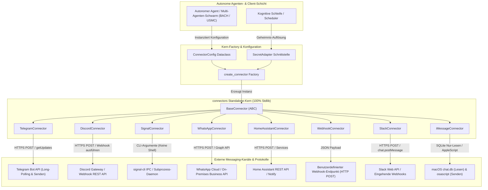
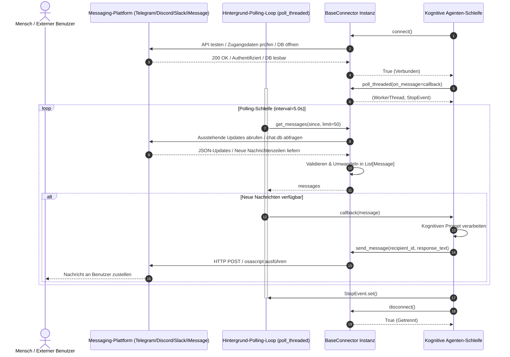

# connectors

[🇬🇧 EN](README.md) | **🇩🇪 Deutsch** | [🇪🇸 ES](README_es.md) | [🇯🇵 JA](README_ja.md) | [🇷🇺 RU](README_ru.md) | [🇨🇳 ZH](README_zh-Hans.md)

> Standalone, abhängigkeitsfreie Messaging-Connectoren für autonome KI-Agenten — Telegram, Discord, Signal, WhatsApp, Home Assistant, Webhooks, Slack und macOS iMessage.

[](LICENSE)
[](CHANGELOG.md)
[](pyproject.toml)
[](tests/)
[](.github/workflows/tests.yml)
[](pyproject.toml)
[](SECURITY.md)
[](https://github.com/ellmos-ai)
[](https://github.com/open-bricks)
[](llms.txt)

Extrahiert und entkoppelt aus [BACH](https://github.com/ellmos-ai/bach). Kein übergeordnetes Framework erforderlich. Null zwingende Laufzeit-Abhängigkeiten (100% Python-Standardbibliothek).

> [!NOTE]
> **LLM- & Agent-native Architektur**: `connectors` wurde speziell für autonome KI-Agenten, Multi-Agenten-Schwärme und kognitive Ausführungsschleifen (wie [BACH](https://github.com/ellmos-ai/bach), [USMC](https://github.com/ellmos-ai/usmc) und [clutch](https://github.com/ellmos-ai/clutch)) entwickelt. Es stellt einen abhängigkeitsfreien, standardisierten Messaging-Vertrag bereit (`connect()`, `send_message()`, `poll_threaded()`), der es Agenten ermöglicht, mit menschlichen Operatoren über plattformübergreifende Chat-Kanäle ohne Framework-Lock-in zu interagieren. Maschinenlesbarer Kontext unter [llms.txt](llms.txt).

---

## Schnellnavigation

- [Hauptmerkmale](#hauptmerkmale)
- [Systemarchitektur](#systemarchitektur)
- [Interaktiver Nachrichten- & Polling-Lebenszyklus](#interaktiver-nachrichten---polling-lebenszyklus)
- [Unterstützte Connectoren & Status](#unterstuetzte-connectoren--status)
- [Governance- & Sicherheits-Invarianten](#governance---sicherheits-invarianten)
- [Schnellstart](#schnellstart)
- [Slack- & iMessage-Connectoren](#slack---imessage-connectoren)
- [Geheimnis-Verwaltung & Null Datenabfluss](#geheimnis-verwaltung--null-datenabfluss)
- [Thread-Polling & Event-Callbacks](#thread-polling--event-callbacks)
- [Interaktiver Setup-Wizard & Vorlagen](#interaktiver-setup-wizard--vorlagen)
- [BACH-Framework-Integration](#bach-framework-integration)
- [Geschwister-Ökosystem & Partner-Repositories](#geschwister-oekosystem--partner-repositories)
- [Smoke-Testing & Verifikation](#smoke-testing--verifikation)
- [Sicherheitsrichtlinie & Meldeprozess](#sicherheitsrichtlinie--meldeprozess)
- [Drittanbieter-Lizenzen & Hinweise](#drittanbieter-lizenzen--hinweise)
- [Mitwirken](#mitwirken)
- [Lizenz](#lizenz)

---

## Hauptmerkmale

- **100% Python-Standardbibliothek**: Null externe Laufzeit-Pip-Abhängigkeiten (`urllib.request`, `json`, `threading`, `subprocess`, `sqlite3`). Kein Overhead, minimale Angriffsfläche, sofortige Kaltstartfähigkeit.
- **Einheitlicher abstrakter Connector-Vertrag**: Standardisierte `BaseConnector`-Basisklasse mit konsistenten Signaturen für Telegram, Discord, Signal, WhatsApp, Home Assistant, Webhooks, Slack und macOS iMessage.
- **Null Geheimnis-Persistierung & Datenabflussschutz**: Zugangsdaten in `ConnectorConfig.auth_config` sind durch Dataclass `field(repr=False)` geschützt. Alle Klassen-`__repr__()`-Methoden maskieren Tokens, um Credential-Leaks in Protokollen oder Tracebacks zu verhindern.
- **Pluggable Credential-Resolution**: Direkter Zugriff über Umgebungsvariablen (`os.environ`), `.env`-Unterstützung oder entkoppelte `SecretAdapter`-Schnittstelle für externe Vaults.
- **Thread-sicheres, entkoppeltes Polling**: Integrierter `poll_threaded()`-Hintergrund-Worker mit `threading.Event`-Stopp-Signalisierung und isolierter Ausnahmebehandlung.
- **Native macOS iMessage-Integration**: Direktes, schreibgeschütztes Abfragen der macOS `chat.db` (SQLite) und Nachrichtenversand via AppleScript `osascript` mit sicherem Fail-Closed-Verhalten auf Nicht-Darwin-Plattformen.
- **Multi-Plattform-Zertifizierung**: Vollständig getestet und verifiziert unter Ubuntu Linux, Windows und macOS via GitHub Actions.
- **Interaktive Scaffolding-CLI**: Standalone-Setup-Assistent (`python -m connectors.templates.setup_wizard`) mit YAML-Vorlagen für schnelle Connector-Entwicklung.

---

## Systemarchitektur



---

## Interaktiver Nachrichten- & Polling-Lebenszyklus



---

<a id="unterstuetzte-connectoren--status"></a>
## Unterstützte Connectoren & Status

| Connector | Protokoll & Transport | Ziel-Ökosystem | Status | Erforderliche Zugangsdaten |
|:---|:---|:---|:---|:---|
| `telegram` | Telegram Bot API (HTTPS) | Telegram-Gruppen & Direktnachrichten | **Produktion** | `bot_token` |
| `discord` | Discord Bot API / Webhook (HTTPS) | Discord-Server & Kanäle | **Produktion** | `bot_token` oder `webhook_url` |
| `signal` | `signal-cli` Prozess-IPC | Ende-zu-Ende verschlüsselter Signal Messenger | **Produktion** | `phone_number` |
| `whatsapp` | WhatsApp Business REST API | Meta Cloud API / On-Premises | **Produktion** | `api_token`, `phone_number_id` |
| `homeassistant` | Home Assistant REST API | Smart-Home-Benachrichtigungen & Steuerung | **Produktion** | `access_token` |
| `webhook` | Generischer HTTP POST (JSON Payload) | Eigene Webhooks & Ingestion | **Basis** | Optional `api_key` / `secret` |
| `slack` | Slack Web API / Eingehender Webhook (HTTPS) | Slack-Kanäle & Workspaces | **Produktion** | `bot_token` oder `webhook_url` |
| `imessage` | macOS `chat.db` SQLite & `osascript` IPC | Apple iMessage / macOS Desktop | **Produktion** | Keine (macOS Festplattenvollzugriff) |

---

<a id="governance---sicherheits-invarianten"></a>
## Governance- & Sicherheits-Invarianten

| Invarianten-ID | Sicherheits-Invariante | Architektonische Umsetzung | Nachweise & Garantien |
|:---|:---|:---|:---|
| `INV-LOCAL-01` | **Null Laufzeit-Abhängigkeiten** | 100% Python-Standardbibliothek (`urllib.request`, `json`, `threading`, `subprocess`, `sqlite3`). | Geprüft in `pyproject.toml` (`dependencies = []`) und Regressionstests. |
| `INV-SECRET-02` | **Null Geheimnis-Persistierung** | Zugangsdaten liegen ausschließlich flüchtig im Speicher; keine Datei- oder SQLite-Ablage. | Getestet in `tests/test_repository_hygiene.py` und `tests/test_behavior.py`. |
| `INV-MASK-03` | **Maskierte String-Darstellung** | `ConnectorConfig.auth_config` nutzt `field(repr=False)`; Klassen-`__repr__()` maskiert Tokens. | Strikte Assertion-Tests verhindern Token-Leaks in Log-Ausgaben. |
| `INV-SHELL-04` | **Immun gegen Shell-Injection** | Prozessaufrufe in `SignalConnector` und `iMessageConnector` übergeben Parameterlisten (`shell=False`). | Verhindert Befehlsinjektionen unter POSIX- und Windows-Umgebungen. |
| `INV-ASYNC-05` | **Nicht-blockierende Ausführung** | `poll_threaded()` verwaltet Daemon-Threads mit kooperativem Abbruch (`threading.Event`). | Verhindert Blockaden von Event-Loops; sicheres Herunterfahren garantiert. |
| `INV-FAIL-06` | **Fail-Closed Fehlerbehandlung** | Netzwerkfehler und ungültige Payloads liefern `False` oder leere Listen ohne Abstürze. | Agentenschleifen bleiben stabil ohne unbehandelte Laufzeitfehler. |
| `INV-PLAT-07` | **Lokale Plattform-Isolation** | `iMessageConnector` liest macOS `chat.db` strikt read-only; Nicht-Darwin-Systeme schlagen sicher fehl. | Verifiziert in plattformübergreifenden Test-Suites und Isolationstests. |
| `INV-PRIV-08` | **Unprivilegierte Ausführung** | Vollständiger Betrieb im normalen Benutzerkontext ohne Root-, Sudo- oder Admin-Rechte. | Festgeschrieben in der Sicherheitsrichtlinie und ohne privilegierte Syscalls auditiert. |
| `INV-CI-09` | **Multi-Plattform-Unterstützung** | Pfadtrenner und Subprozess-Verhalten über Betriebssystemfamilien hinweg normalisiert. | Kontinuierlich geprüft in CI-Matrix über Ubuntu Linux, Windows und macOS. |
| `INV-SLA-10` | **Bilinguale Sicherheits-Governance** | 48-Stunden-Reaktions-SLA und 5-Werktage-Triage-Zusage in zweisprachiger `SECURITY.md`. | Automatisch verifiziert in `tests/test_metadata.py` und `tests/test_repository_hygiene.py`. |

---

## Schnellstart

### Installation

```bash
# Kernpaket (100% Standardbibliothek - keine externen Pip-Abhängigkeiten)
pip install git+https://github.com/ellmos-ai/connectors.git

# Editierbare lokale Entwicklungsinstallation
git clone https://github.com/ellmos-ai/connectors.git
cd connectors
pip install -e ".[test,wizard]"
```

### Grundlegende Telegram-Nutzung

```python
import os
from connectors import create_connector, ConnectorConfig

# Telegram-Bot über Umgebungsvariablen konfigurieren
config = ConnectorConfig(
    name="agent_assistant",
    connector_type="telegram",
    auth_config={"bot_token": os.environ["TELEGRAM_BOT_TOKEN"]},
    options={"owner_chat_id": os.environ.get("OWNER_CHAT_ID", "")},
)

connector = create_connector(config)

if connector.connect():
    # Ausgehende Nachricht versenden
    connector.send_message(recipient=os.environ["OWNER_CHAT_ID"], content="Agent online und einsatzbereit.")

    # Nicht-blockierenden Hintergrund-Empfänger starten
    def handle_incoming(msg):
        print(f"Empfangen von {msg.sender}: {msg.content}")

    thread, stop_event = connector.poll_threaded(on_message=handle_incoming, interval=3.0)

    # Polling bei Bedarf beenden
    # stop_event.set()
    # connector.disconnect()
```

### Discord Webhook-Nutzung

```python
import os
from connectors import create_connector, ConnectorConfig

config = ConnectorConfig(
    name="discord_alerts",
    connector_type="discord",
    auth_config={"webhook_url": os.environ["DISCORD_WEBHOOK_URL"]},
)

connector = create_connector(config)
if connector.connect():
    connector.send_message(recipient="", content="Bereitstellungs-Pipeline erfolgreich abgeschlossen! :rocket:")
```

---

## Slack- & iMessage-Connectoren

### Slack Bot- & Webhook-Nutzung

```python
import os
from connectors import create_connector, ConnectorConfig

# Option A: Slack Bot API (Token-basiert)
config_bot = ConnectorConfig(
    name="slack_bot",
    connector_type="slack",
    auth_config={"bot_token": os.environ["SLACK_BOT_TOKEN"]},
    options={"channel": "#general"},
)
slack_conn = create_connector(config_bot)
if slack_conn.connect():
    slack_conn.send_message(recipient="#general", content="Hallo vom autonomen Agenten!")

# Option B: Slack Eingehender Webhook
config_webhook = ConnectorConfig(
    name="slack_webhook",
    connector_type="slack",
    auth_config={"webhook_url": os.environ["SLACK_WEBHOOK_URL"]},
)
webhook_conn = create_connector(config_webhook)
if webhook_conn.connect():
    webhook_conn.send_message(recipient="", content="Warnung: Hohe Latenz festgestellt.")
```

### macOS iMessage-Nutzung

```python
from connectors import create_connector, ConnectorConfig

# Verbindung zu lokalem macOS iMessage (erfordert macOS und Festplattenvollzugriff für chat.db)
config_imessage = ConnectorConfig(
    name="imessage_local",
    connector_type="imessage",
    options={"service": "iMessage"},
)

imessage_conn = create_connector(config_imessage)
if imessage_conn.connect():
    # Aktuelle Nachrichten aus SQLite chat.db abfragen
    messages = imessage_conn.get_messages(limit=5)
    for msg in messages:
        print(f"[{msg.timestamp}] {msg.sender}: {msg.content}")

    # Ausgehende Nachricht über AppleScript osascript versenden
    imessage_conn.send_message(recipient="+1234567890", content="Agenten-Aufgabe abgeschlossen.")
```

---

## Geheimnis-Verwaltung & Null Datenabfluss

Um das versehentliche Offenlegen von Bot-Tokens, API-Schlüsseln oder Telefonnummern auszuschließen, bietet `connectors` drei Stufen der Geheimnis-Auflösung:

```python
# Stufe 1: Direkte Umgebungsvariablen (Empfohlen für CLI & Container)
config = ConnectorConfig(
    name="telegram_bot",
    connector_type="telegram",
    auth_config={"bot_token": os.environ.get("TELEGRAM_BOT_TOKEN", "")}
)

# Stufe 2: Entkoppelter SecretAdapter (Empfohlen für Enterprise-Vaults & Frameworks)
from connectors.base import SecretAdapter

class CustomVaultAdapter(SecretAdapter):
    def __init__(self, vault_client):
        self.vault = vault_client

    def get_secret(self, key: str) -> str:
        return self.vault.read_secret(f"secret/connectors/{key}")

connector = create_connector(config, secret_adapter=CustomVaultAdapter(vault_client))
```

---

## Thread-Polling & Event-Callbacks

Alle Connectoren implementieren Threaded Polling für asynchrone, nicht-blockierende Ereignisverarbeitung:

```python
import time
from connectors import create_connector, ConnectorConfig

config = ConnectorConfig(
    name="signal_listener",
    connector_type="signal",
    auth_config={"phone_number": "+1234567890"},
)

conn = create_connector(config)
if conn.connect():
    def on_user_input(message):
        print(f"Nachricht von {message.sender} um {message.timestamp}: {message.content}")

    # Hintergrund-Thread starten
    worker_thread, stop_event = conn.poll_threaded(
        on_message=on_user_input,
        interval=5.0
    )

    try:
        while True:
            time.sleep(1)
    except KeyboardInterrupt:
        print("Empfang wird beendet...")
        stop_event.set()
        worker_thread.join(timeout=10.0)
        conn.disconnect()
```

---

## Interaktiver Setup-Wizard & Vorlagen

Erstellen Sie neue Connectoren mühelos mit dem integrierten Scaffolding-Assistenten:

```bash
# Interaktiven CLI-Wizard ausführen
python -m connectors.templates.setup_wizard
```

Der Assistent führt durch die Auswahl von Transportprotokollen, Zugangsdaten und generiert produktionsreife Connector-Skelette gemäß der `BaseConnector`-Spezifikation. Fertige YAML-Konfigurationsvorlagen finden sich in [`templates/`](templates/):

- [`templates/signal_template.yaml`](templates/signal_template.yaml)
- [`templates/discord_template.yaml`](templates/discord_template.yaml)
- [`templates/telegram_template.yaml`](templates/telegram_template.yaml)
- [`templates/whatsapp_template.yaml`](templates/whatsapp_template.yaml)

---

## BACH-Framework-Integration

Um `connectors` in den [BACH Autonomous Cognitive Hub](https://github.com/ellmos-ai/bach) zu integrieren, binden Sie BACHs internes Geheimnis-Management über den `SecretAdapter` an:

```python
from connectors.base import SecretAdapter
from connectors import create_connector, ConnectorConfig

class BachSecretAdapter(SecretAdapter):
    def get_secret(self, key: str) -> str:
        try:
            from hub.secrets_handler import SecretsHandler
            return SecretsHandler().get_secret(key) or ""
        except ImportError:
            return ""

# BACH-Laufzeit mit externen Connectoren verknüpfen
config = ConnectorConfig(name="bach_telegram", connector_type="telegram")
connector = create_connector(config, secret_adapter=BachSecretAdapter())
```

---

<a id="geschwister-oekosystem--partner-repositories"></a>
## Geschwister-Ökosystem & Partner-Repositories

`connectors` ist ein zentraler Baustein des Open-Source-Ökosystems für autonome Agenten und Desktop-Werkzeuge unter [ellmos-ai](https://github.com/ellmos-ai) und [open-bricks](https://github.com/open-bricks):

| Repository | Organisation | Architektonische Rolle im Autonomen Agenten-Stack |
|:---|:---|:---|
| [`ellmos-ai/bach`](https://github.com/ellmos-ai/bach) | `ellmos-ai` | Kognitiver Kern für autonome Agenten & Multi-Agenten-Supervisor. |
| [`ellmos-ai/usmc`](https://github.com/ellmos-ai/usmc) | `ellmos-ai` | Universal Shared Memory Coordinator (Agent-zu-Agent-Zustand). |
| [`ellmos-ai/clutch`](https://github.com/ellmos-ai/clutch) | `ellmos-ai` | Dynamisches LLM-Routing, Fallback-Management & Kostenoptimierung. |
| [`ellmos-ai/companion-for-agy`](https://github.com/ellmos-ai/companion-for-agy) | `ellmos-ai` | PTY-stdout-Erfassung, interaktive Telemetrie & Laufzeit-Wrapper. |
| [`ellmos-ai/system-gap-master`](https://github.com/ellmos-ai/system-gap-master) | `ellmos-ai` | Multi-Host-Dateisystemabgleich & Konflikt-Management. |
| [`dev-bricks/lock-master`](https://github.com/dev-bricks/lock-master) | `dev-bricks` | Verteilte Multi-Agenten-Parallelität & kooperatives Locking. |
| [`dev-bricks/ticket-master`](https://github.com/dev-bricks/ticket-master) | `dev-bricks` | Asynchrone Ticketwarteschlangen & Aufgabenverteilung. |
| [`dev-bricks/automation-master`](https://github.com/dev-bricks/automation-master) | `dev-bricks` | Multi-Agenten-Flottenorchestrierung & Headless-Controller. |
| [`dev-bricks/safe-start-for-codex`](https://github.com/dev-bricks/safe-start-for-codex) | `dev-bricks` | Sichere Agenten-Sandbox-Initialisierung & Prozessverwaltung. |
| [`file-bricks/CloudLockFixer`](https://github.com/file-bricks/CloudLockFixer) | `file-bricks` | Resiliente Cloud-Dateisperren-Handhabung (`cldflt.sys`). |
| [`file-bricks/ProSync`](https://github.com/file-bricks/ProSync) | `file-bricks` | Performante Ordnerspiegelung & geräteübergreifender Dateisync. |
| [`file-bricks/ExplorerPro`](https://github.com/file-bricks/ExplorerPro) | `file-bricks` | Erweiterte Windows Explorer Shell-Erweiterungen & Datei-Inspektoren. |
| [`doc-bricks/FormularErstellen`](https://github.com/doc-bricks/FormularErstellen) | `doc-bricks` | Automatisierte Dokumentenerstellung & formularbasierte Workflows. |
| [`ellmos-ai/n8n-manager-mcp`](https://github.com/ellmos-ai/n8n-manager-mcp) | `ellmos-ai` | Autonome n8n-Workflow-Verwaltung & Staging über MCP. |
| [`ellmos-ai/ellmos-homebase-mcp`](https://github.com/ellmos-ai/ellmos-homebase-mcp) | `ellmos-ai` | Lokales Smart-Home-Gateway & Telemetrie-Schnittstelle über MCP. |
| [`open-bricks/.github`](https://github.com/open-bricks) | `open-bricks` | Zentrale Open-Source-Governance & geteilte CI-Vorlagen. |

---

## Smoke-Testing & Verifikation

Führen Sie die umfassende Testsuite und Validierungsschritte lokal aus:

```bash
# 1. Alle Pytest-Regressions- und Vertragstests ausführen
pytest -v

# 2. Standalone-Import-Smoketest ausführen
python tests/test_imports.py

# 3. Python-Bytecode-Kompilierung aller Module prüfen
python -m compileall -q -x "(^|[\\/])(build|templates[\\/]connector_template\.py)" .

# 4. Automatisierte Codestil- und Linter-Prüfung durchführen
ruff check .
```

---

## Sicherheitsrichtlinie & Meldeprozess

Sicherheit und Datenschutz sind fundamentale Designprinzipien von `connectors`. Wir verfolgen eine strikte Richtlinie:

- **Unterstützte Versionen**: Sicherheitsupdates und Patches werden aktiv für `1.2.x` und `1.1.x` bereitgestellt.
- **48-Stunden-Reaktions-SLA**: Jede Meldung erhält innerhalb von 48 Stunden eine Eingangsbestätigung und innerhalb von 5 Werktagen eine Ersteinschätzung.
- **Meldekanal**: Sicherheitslücken bitte vertraulich über [GitHub Security Advisories](https://github.com/ellmos-ai/connectors/security/advisories/new) oder direkt über die in [`SECURITY.md`](SECURITY.md) hinterlegten Maintainer-Kontakte melden.

---

## Drittanbieter-Lizenzen & Hinweise

`connectors` basiert auf einer Clean-Room-Architektur ohne Laufzeit-Abhängigkeiten. Sämtliche Kernmodule nutzen ausschließlich die Python-Standardbibliothek unter der PSF-Lizenz.

Attributionen und Lizenzbedingungen für konzeptionelle Vorbilder ([OpenClaw](https://github.com/openclaw/openclaw), [Hermes Agent](https://github.com/NousResearch/hermes-agent)) sowie Entwicklungswerkzeuge ([PyYAML](https://pyyaml.org/), [pytest](https://pytest.org/), [signal-cli](https://github.com/AsamK/signal-cli)) sind in [`THIRD_PARTY_LICENSES.md`](THIRD_PARTY_LICENSES.md) dokumentiert.

---

## Mitwirken

Beiträge sind herzlich willkommen! Bitte stellen Sie sicher:
1. Alle Änderungen wahren das Prinzip der abhängigkeitsfreien Standardbibliothek (`dependencies = []` in `pyproject.toml`).
2. Zugangsdaten sind in String-Darstellungen maskiert und werden niemals persistiert (`field(repr=False)`).
3. Subprozess-Aufrufe vermeiden Shell-Ausführungen (`shell=False`).
4. Automatisierte Testsuiten und Linter-Prüfungen laufen fehlerfrei durch (`pytest -v` und `ruff check .`).

---

## Lizenz

Dieses Projekt ist unter den Bedingungen der [MIT-Lizenz](LICENSE) lizenziert.
