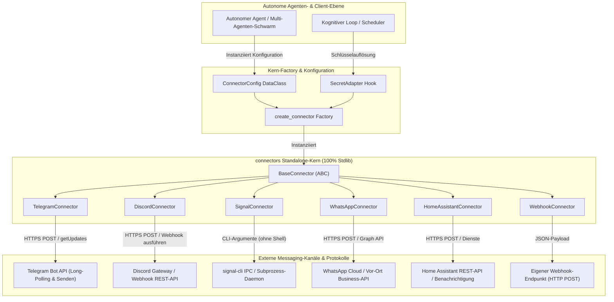
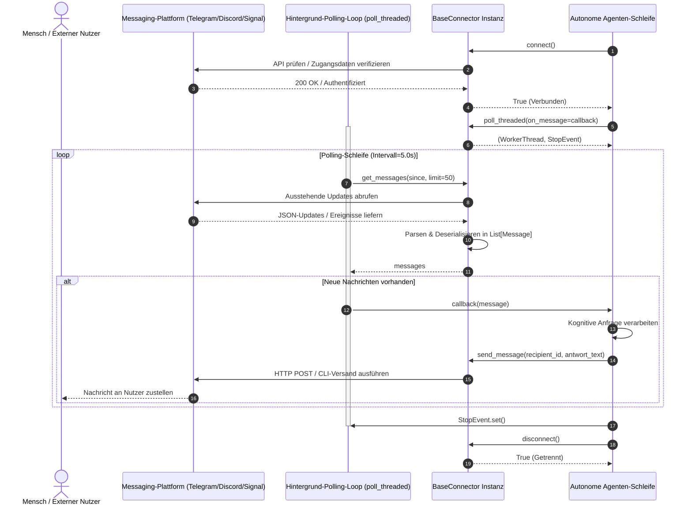

# connectors — Deutsch

[🇬🇧 EN](README.md) | **🇩🇪 DE** | [🇪🇸 ES](README_es.md) | [🇯🇵 JA](README_ja.md) | [🇷🇺 RU](README_ru.md) | [🇨🇳 ZH](README_zh-Hans.md)

> Eigenständige, abhängigkeitsfreie Messaging-Connectoren für autonome KI-Agenten — Telegram, Discord, Signal, WhatsApp, Home Assistant und Webhooks.

[](LICENSE)
[](CHANGELOG.md)
[](pyproject.toml)
[](tests/)
[](.github/workflows/tests.yml)
[](pyproject.toml)
[](SECURITY.md)
[](https://github.com/ellmos-ai)
[](https://github.com/open-bricks)
[](llms.txt)

Aus [BACH](https://github.com/ellmos-ai/bach) extrahiert und vollständig entkoppelt. Kein externes Framework erforderlich. Keine obligatorischen Laufzeit-Abhängigkeiten (100% Python-Standardbibliothek).

> [!NOTE]
> **LLM- & Agenten-Native Architektur**: `connectors` wurde gezielt für autonome KI-Agenten, Multi-Agenten-Schwärme und kognitive Laufzeitschleifen (wie [BACH](https://github.com/ellmos-ai/bach), [USMC](https://github.com/ellmos-ai/usmc) und [clutch](https://github.com/ellmos-ai/clutch)) entwickelt. Es bietet einen standardisierten Messaging-Vertrag (`connect()`, `send_message()`, `poll_threaded()`), über den KI-Agenten plattformübergreifend mit menschlichen Bedienern interagieren können, ohne an ein bestimmtes Framework gebunden zu sein. Maschinenlesbarer Kontext verfügbar unter [llms.txt](llms.txt).

---

## Schnellnavigation

- [Kernfähigkeiten](#kernfähigkeiten)
- [Systemarchitektur](#systemarchitektur)
- [Interaktiver Nachrichten- & Polling-Lebenszyklus](#interaktiver-nachrichten--polling-lebenszyklus)
- [Unterstützte Connectoren & Status](#unterstützte-connectoren--status)
- [Governance- & Sicherheits-Invarianten](#governance--sicherheits-invarianten)
- [Schnellstart](#schnellstart)
- [Secret-Management & Null Datenabfluss](#secret-management--null-datenabfluss)
- [Threaded Polling & Event-Callbacks](#threaded-polling--event-callbacks)
- [Interaktiver Setup-Wizard & Vorlagen](#interaktiver-setup-wizard--vorlagen)
- [BACH Framework-Integration](#bach-framework-integration)
- [Geschwister-Ökosystem & Partner-Repositories](#geschwister-ökosystem--partner-repositories)
- [Smoke-Tests & Verifikation](#smoke-tests--verifikation)
- [Sicherheitsrichtlinie & Verwundbarkeitsmeldungen](#sicherheitsrichtlinie--verwundbarkeitsmeldungen)

---

## Kernfähigkeiten

- **100% Python-Standardbibliothek**: Keine externen pip-Laufzeitabhängigkeiten (`urllib`, `json`, `threading`, `subprocess`). Schlank, wartungsarm und minimale Angriffsfläche.
- **Einheitlicher abstrakter Connector-Vertrag**: Standardisierte `BaseConnector`-ABC mit identischen Schnittstellen für Telegram, Discord, Signal, WhatsApp, Home Assistant und Webhooks.
- **Null Geheimnis-Abfluss zur Laufzeit**: In `ConnectorConfig.auth_config` hinterlegte Zugangsdaten sind per `field(repr=False)` geschützt. Alle `__repr__()`-Methoden maskieren sensible Werte in Logs.
- **Modulare Schlüsselauflösung**: Direkter Zugriff über Umgebungsvariablen (`os.environ`), `.env`-Unterstützung oder per entkoppeltem `SecretAdapter` für Vaults und Frameworks.
- **Thread-sicheres entkoppeltes Polling**: Integrierter Hintergrund-Worker `poll_threaded()` mit kooperativem Abbruch über `threading.Event` und strikter Fehlerisolation.
- **Plattformübergreifend zertifiziert**: Vollständig validiert unter Ubuntu Linux, Windows und macOS via GitHub Actions.
- **Interaktives Scaffolding-CLI**: Eigenständiger Setup-Wizard (`python -m connectors.templates.setup_wizard`) mit YAML-Vorlagen für die schnelle Connector-Entwicklung.

---

## Systemarchitektur



---

## Interaktiver Nachrichten- & Polling-Lebenszyklus



---

## Unterstützte Connectoren & Status

| Connector | Protokoll & Transport | Ziel-Ökosystem | Status | Erforderliche Zugangsdaten |
|:---|:---|:---|:---|:---|
| `telegram` | Telegram Bot API (HTTPS) | Telegram-Gruppen & Direktnachrichten | **Produktion** | `bot_token` |
| `discord` | Discord Bot API / Webhook (HTTPS) | Discord-Server & Kanäle | **Produktion** | `bot_token` oder `webhook_url` |
| `signal` | `signal-cli` Prozess-IPC | Verschlüsselter Signal Messenger | **Produktion** | `phone_number` |
| `whatsapp` | WhatsApp Business REST-API | Meta Cloud API / On-Premises | **Produktion** | `api_token`, `phone_number_id` |
| `homeassistant` | Home Assistant REST-API | Smart Home Benachrichtigungen | **Produktion** | `access_token` |
| `webhook` | Generischer HTTP POST (JSON-Payload) | Eigene Webhooks & Datenerfassung | **Basis/Stub** | Optional `api_key` / `secret` |

---

## Governance- & Sicherheits-Invarianten

| Sicherheits-Invariante | Architekturale Umsetzung | Validierung & Garantien |
|:---|:---|:---|
| **Null Laufzeit-Abhängigkeiten** | 100% Python-Standardbibliothek (`urllib.request`, `json`, `threading`, `subprocess`). | Überprüft in `pyproject.toml` (`dependencies = []`) und Regressionstests. |
| **Null Geheimnis-Persistierung** | Zugangsdaten liegen ausschließlich flüchtig im RAM; keine Speicherung auf Datenträgern oder in Logs. | Verifiziert in `tests/test_repository_hygiene.py` und `tests/test_behavior.py`. |
| **Maskierte String-Darstellung** | `ConnectorConfig.auth_config` nutzt `field(repr=False)`; `__repr__()` maskiert Geheimnisse. | Strikte Assertion-Tests unterbinden Token-Leaks in Log-Ausgaben. |
| **Immun gegen Shell-Injection** | Subprozesse in `SignalConnector` übergeben Argumente als Array (`shell=False`). | Verhindert Befehlsinjektionen unter POSIX- und Windows-Umgebungen. |
| **Nicht-blockierende Ausführung** | `poll_threaded()` verwaltet Daemon-Threads mit Signal-Abbruch (`threading.Event`). | Verhindert Blockieren der Ereignisschleife; sauberer Shutdown garantiert. |
| **Fail-Closed Fehlerbehandlung** | Netzwerkfehler und ungültige Payloads liefern `False` oder leere Listen; Logs nach stderr. | Agenten-Schleifen bleiben stabil ohne unkontrollierte Laufzeitabstürze. |
| **Multi-Plattform-Unterstützung** | Pfad- und Subprozesstrennungen sind über Betriebssystemfamilien hinweg normalisiert. | Geprüft in der CI-Matrix unter Ubuntu Linux, Windows und macOS. |

---

## Schnellstart

### Installation

```bash
# Kernpaket (100% Standardbibliothek - keine externen pip-Pakete erforderlich)
pip install git+https://github.com/ellmos-ai/connectors.git

# Lokale editierbare Entwicklungsumgebung
git clone https://github.com/ellmos-ai/connectors.git
cd connectors
pip install -e ".[test,wizard]"
```

### Telegram-Nutzung

```python
import os
from connectors import create_connector, ConnectorConfig

# Telegram-Bot per Umgebungsvariablen konfigurieren
config = ConnectorConfig(
    name="agenten_assistent",
    connector_type="telegram",
    auth_config={"bot_token": os.environ["TELEGRAM_BOT_TOKEN"]},
    options={"owner_chat_id": os.environ.get("OWNER_CHAT_ID", "")},
)

connector = create_connector(config)

if connector.connect():
    # Ausgehende Nachricht senden
    connector.send_message(recipient=os.environ["OWNER_CHAT_ID"], content="Agent online und einsatzbereit.")

    # Nicht-blockierenden Hintergrund-Empfänger starten
    def verarbeite_eingang(msg):
        print(f"Empfangen von {msg.sender}: {msg.content}")

    thread, stop_event = connector.poll_threaded(on_message=verarbeite_eingang, interval=3.0)

    # Polling beenden:
    # stop_event.set()
    # connector.disconnect()
```

### Discord Webhook-Nutzung

```python
import os
from connectors import create_connector, ConnectorConfig

config = ConnectorConfig(
    name="discord_alarme",
    connector_type="discord",
    auth_config={"webhook_url": os.environ["DISCORD_WEBHOOK_URL"]},
)

connector = create_connector(config)
if connector.connect():
    connector.send_message(recipient="", content="Deployment-Pipeline erfolgreich abgeschlossen! :rocket:")
```

---

## Secret-Management & Null Datenabfluss

Um das unbeabsichtigte Offenlegen sensibler Bot-Tokens, API-Schlüssel oder Telefonnummern auszuschließen, unterstützt `connectors` drei Sicherheitsstufen:

```python
# Stufe 1: Direkte Umgebungsvariablen (Empfohlen für CLI & Container-Laufzeiten)
config = ConnectorConfig(
    name="telegram_bot",
    connector_type="telegram",
    auth_config={"bot_token": os.environ.get("TELEGRAM_BOT_TOKEN", "")}
)

# Stufe 2: Entkoppelter SecretAdapter (Empfohlen für Vaults & Frameworks)
from connectors.base import SecretAdapter

class CustomVaultAdapter(SecretAdapter):
    def __init__(self, vault_client):
        self.vault = vault_client

    def get_secret(self, key: str) -> str:
        return self.vault.read_secret(f"secret/connectors/{key}")

connector = create_connector(config, secret_adapter=CustomVaultAdapter(vault_client))
```

---

## Threaded Polling & Event-Callbacks

Alle Connectoren implementieren asynchrones, thread-gestütztes Polling für ereignisgesteuerte Agenten-Loops:

```python
import time
from connectors import create_connector, ConnectorConfig

config = ConnectorConfig(
    name="signal_empfaenger",
    connector_type="signal",
    auth_config={"phone_number": "+1234567890"},
)

conn = create_connector(config)
if conn.connect():
    def on_user_input(message):
        print(f"Nachricht von {message.sender} um {message.timestamp}: {message.content}")

    # Hintergrund-Thread starten
    worker_thread, stop_event = conn.poll_threaded(
        on_message=on_user_input,
        interval=5.0
    )

    try:
        while True:
            time.sleep(1)
    except KeyboardInterrupt:
        print("Empfänger wird gestoppt...")
        stop_event.set()
        worker_thread.join(timeout=10.0)
        conn.disconnect()
```

---

## Interaktiver Setup-Wizard & Vorlagen

Erstellen Sie neue Connectoren schnell und unkompliziert mit dem integrierten Scaffolding-Assistenten:

```bash
# Interaktiven CLI-Wizard ausführen
python -m connectors.templates.setup_wizard
```

Der Assistent führt durch die Auswahl von Transportprotokollen und Authentifizierungsmethoden und generiert modulare Gerüste gemäß der `BaseConnector`-Spezifikation. Fertige YAML-Vorlagen liegen in [`templates/`](templates/):

- [`templates/signal_template.yaml`](templates/signal_template.yaml)
- [`templates/discord_template.yaml`](templates/discord_template.yaml)
- [`templates/telegram_template.yaml`](templates/telegram_template.yaml)
- [`templates/whatsapp_template.yaml`](templates/whatsapp_template.yaml)

---

## BACH Framework-Integration

Zur Integration von `connectors` in den [BACH Autonomous Cognitive Hub](https://github.com/ellmos-ai/bach) wird BACHs internes Secret-Management über den `SecretAdapter` angebunden:

```python
from connectors.base import SecretAdapter
from connectors import create_connector, ConnectorConfig

class BachSecretAdapter(SecretAdapter):
    def get_secret(self, key: str) -> str:
        try:
            from hub.secrets_handler import SecretsHandler
            return SecretsHandler().get_secret(key) or ""
        except ImportError:
            return ""

# BACH-Laufzeit mit externen Connectoren verknüpfen
config = ConnectorConfig(name="bach_telegram", connector_type="telegram")
connector = create_connector(config, secret_adapter=BachSecretAdapter())
```

---

## Geschwister-Ökosystem & Partner-Repositories

`connectors` ist ein zentraler Baustein des Ökosystems für autonome Agenten und modulare Desktop-Werkzeuge unter der Schirmherrschaft von [ellmos-ai](https://github.com/ellmos-ai) und [open-bricks](https://github.com/open-bricks):

| Repository | Organisation | Funktion im Stack autonomer Agenten |
|:---|:---|:---|
| [`ellmos-ai/bach`](https://github.com/ellmos-ai/bach) | `ellmos-ai` | Kognitiver Kern für autonome Agenten & Multi-Agenten-Supervisor. |
| [`ellmos-ai/usmc`](https://github.com/ellmos-ai/usmc) | `ellmos-ai` | Universal Shared Memory Coordinator (Agent-zu-Agent-Zustand). |
| [`ellmos-ai/clutch`](https://github.com/ellmos-ai/clutch) | `ellmos-ai` | Dynamisches LLM-Routing, Modell-Fallback & Kostenmanagement. |
| [`ellmos-ai/companion-for-agy`](https://github.com/ellmos-ai/companion-for-agy) | `ellmos-ai` | PTY stdout Telemetrie-Erfassung & Agenten-Wrapper. |
| [`ellmos-ai/system-gap-master`](https://github.com/ellmos-ai/system-gap-master) | `ellmos-ai` | Host-übergreifender Dateisystem-Abgleich & Konfliktbereinigung. |
| [`dev-bricks/lock-master`](https://github.com/dev-bricks/lock-master) | `dev-bricks` | Verteilte Concurrency & kooperatives Locking für Agenten. |
| [`dev-bricks/ticket-master`](https://github.com/dev-bricks/ticket-master) | `dev-bricks` | Asynchrone Ticketwarteschlangen & Aufgabenverteilung. |
| [`dev-bricks/automation-master`](https://github.com/dev-bricks/automation-master) | `dev-bricks` | Flotten-Orchestrierung & Headless-Automationssteuerung. |
| [`dev-bricks/safe-start-for-codex`](https://github.com/dev-bricks/safe-start-for-codex) | `dev-bricks` | Gesicherte Sandbox-Initialisierung für Agentenprozesse. |
| [`file-bricks/CloudLockFixer`](https://github.com/file-bricks/CloudLockFixer) | `file-bricks` | Robuste IO-Engine mit Erkennung von `cldflt.sys`-Dateisperren. |
| [`open-bricks/.github`](https://github.com/open-bricks) | `open-bricks` | Zentrale Open-Source-Governance & gemeinsame CI-Workflows. |

---

## Smoke-Tests & Verifikation

Führen Sie die umfassende Testsuite und Prüfskripte lokal aus:

```bash
# 1. Alle Pytest-Regressions- und Vertragstests ausführen
pytest -v

# 2. Standalone-Importsmoke-Test prüfen
python tests/test_imports.py

# 3. Python-Bytecode-Kompilierung über alle Module verifizieren
python -m compileall -q -x "(^|[\\/])(build|templates[\\/]connector_template\.py)" .

# 4. Automatisierte Codestil- und Linter-Prüfung
ruff check .
```

---

## Sicherheitsrichtlinie & Verwundbarkeitsmeldungen

Sicherheit und Datenschutz sind fundamentale Entwurfsprinzipien von `connectors`. Wir gewährleisten ein strukturiertes Sicherheitsmanagement:

- **Unterstützte Versionen**: Sicherheitsupdates und Patches werden aktiv für die Versionsreihe `1.1.x` bereitgestellt.
- **48-Stunden Reaktions-SLA**: Alle gemeldeten Sicherheitsvorfälle erhalten eine Eingangsbestätigung binnen 48 Stunden und eine Erstbewertung innerhalb von 5 Werktagen.
- **Meldewege**: Verwundbarkeiten bitte vertraulich über [GitHub Security Advisories](https://github.com/ellmos-ai/connectors/security/advisories/new) oder über die in [`SECURITY.md`](SECURITY.md) genannten Maintainer-Kontakte melden.
