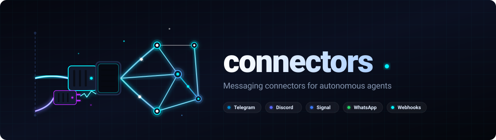

# connectors — Русский

[🇬🇧 EN](README.md) | [🇩🇪 DE](README_de.md) | [🇪🇸 ES](README_es.md) | [🇯🇵 JA](README_ja.md) | **🇷🇺 RU** | [🇨🇳 ZH](README_zh-Hans.md)

[](LICENSE)
[](CHANGELOG.md)

Автономный Python-модуль для коннекторов обмена сообщениями: Telegram, Discord, Signal,
WhatsApp, Home Assistant и универсальные HTTP-вебхуки.

Извлечён и отвязан от [BACH](https://github.com/ellmos-ai/bach).
Фреймворк не требуется. Нет обязательных внешних зависимостей (только стандартная библиотека).

> **Статус:** v1.1.0 — работоспособен, ещё не опубликован как отдельный пакет.
> Запланированные улучшения: [TODO.md](TODO.md)

## Поддерживаемые коннекторы

| Коннектор       | Протокол              | Источник                    | Статус    |
|-----------------|-----------------------|-----------------------------|-----------|
| `telegram`      | Telegram Bot API      | Портирован из BACH          | Стабильный|
| `discord`       | Discord Bot + Webhook | Портирован из BACH          | Стабильный|
| `signal`        | signal-cli            | Портирован из BACH          | Стабильный|
| `whatsapp`      | WhatsApp Business API | Портирован из BACH          | Стабильный|
| `homeassistant` | Home Assistant REST   | Портирован из BACH          | Стабильный|
| `webhook`       | Универсальный HTTP POST| Новый (нет аналога в BACH) | Заглушка  |

Коннектор `webhook` — **новое добавление**: упоминался в ранних планировочных документах,
но в BACH не существовал. Работает как базовый исходящий HTTP POST коннектор и явно
отмечен как заглушка/базис.

## Быстрый старт

```python
import os
from connectors import create_connector, ConnectorConfig

# Пример Telegram
config = ConnectorConfig(
    name="my_bot",
    connector_type="telegram",
    auth_config={"bot_token": os.environ["TG_BOT_TOKEN"]},
    options={"owner_chat_id": ""},   # опционально: принимать только из этого чата
)
conn = create_connector(config)
if conn.connect():
    conn.send_message("CHAT_ID", "Привет!")

# Получение сообщений (поллинг)
thread, stop = conn.poll_threaded(on_message=lambda m: print(m.content))
# ... позже:
stop.set()
```

## Секреты

**Никогда не вписывайте токены прямо в код.** Рекомендуемые подходы:

```python
# 1. Переменные окружения (простейший вариант)
auth_config={"bot_token": os.environ["TG_BOT_TOKEN"]}

# 2. python-dotenv
from dotenv import load_dotenv; load_dotenv()
auth_config={"bot_token": os.getenv("TG_BOT_TOKEN")}

# 3. SecretAdapter (интеграция с фреймворком, напр. BACH)
from connectors.base import SecretAdapter

class MyAdapter(SecretAdapter):
    def get_secret(self, key: str) -> str:
        return my_vault.get(key, "")

conn = create_connector(config, secret_adapter=MyAdapter())
```

## Создание собственного коннектора

Используйте интерактивный мастер:

```bash
pip install pyyaml   # требуется только для мастера
python -m connectors.templates.setup_wizard
```

Или вручную, используя `templates/connector_template.py`:

1. Скопируйте `connector_template.py` в `my_connector.py`
2. Замените все маркеры `{{PLACEHOLDER}}`
3. Реализуйте `connect()`, `disconnect()`, `send_message()`, `get_messages()`
4. Зарегистрируйте в `_CONNECTOR_MAP` файла `__init__.py`

## Интеграция с BACH (опционально)

Для использования этого модуля внутри BACH реализуйте `SecretAdapter`, указывающий
на `hub.secrets_handler.SecretsHandler`:

```python
from connectors.base import SecretAdapter

class BachSecretAdapter(SecretAdapter):
    def get_secret(self, key: str) -> str:
        try:
            from hub.secrets_handler import SecretsHandler
            return SecretsHandler().get_secret(key) or ""
        except ImportError:
            return ""
```

Затем BACH может опционально переключить свой слой `connectors/` на этот модуль.
Подробнее: [BACH-REIMPORT-NOTE.md](BACH-REIMPORT-NOTE.md).

## Структура проекта

```
connectors/
├── __init__.py                  # Фабрика create_connector()
├── base.py                      # BaseConnector, Message, SecretAdapter
├── telegram_connector.py
├── discord_connector.py
├── signal_connector.py
├── whatsapp_connector.py
├── homeassistant_connector.py
├── webhook_connector.py         # Универсальный HTTP (заглушка/базис)
├── templates/
│   ├── connector_template.py    # Шаблон для новых коннекторов
│   ├── setup_wizard.py          # Интерактивный CLI-мастер
│   ├── telegram_template.yaml
│   ├── whatsapp_template.yaml
│   └── notification_template.yaml
├── LICENSE                      # MIT
├── requirements.txt             # pyyaml (только мастер), остальное — stdlib
├── CHANGELOG.md
├── TODO.md
└── llms.txt
```

## Зависимости

- **Ядро:** Python 3.8+, только stdlib (`urllib`, `json`, `threading`, `subprocess`)
- **Мастер настройки:** `pyyaml` (`pip install pyyaml`)
- **signal_connector:** бинарный файл `signal-cli` — https://github.com/AsamK/signal-cli

## Дымовые тесты для разработки

```bash
python -m pip install -e ".[wizard]"
python tests/test_imports.py
python -m compileall -q -x "templates[\\/]+connector_template\\.py" .
```

`templates/connector_template.py` намеренно содержит заполнители и
компилируется только после того, как мастер настройки сформирует
конкретный модуль коннектора.

## Связанные проекты

- **lock-master** (https://github.com/dev-bricks/lock-master) — связанный компонент мультиагентной системы
- **ticket-master** (https://github.com/dev-bricks/ticket-master) — связанный компонент мультиагентной системы

## Связанные модули

- **USMC** (https://github.com/ellmos-ai/usmc): Общая память агентов
- **clutch** (https://github.com/ellmos-ai/clutch): Маршрутизация моделей (Агент → LLM)
- **connectors** (этот модуль): Обмен сообщениями (Агент → человек)
